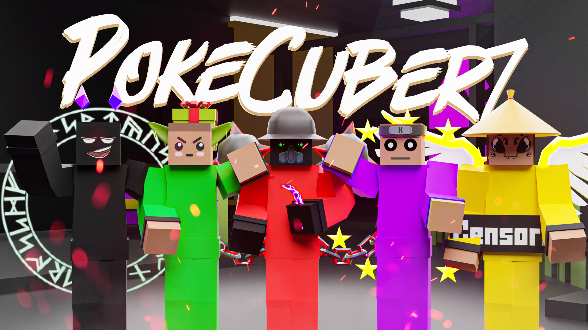
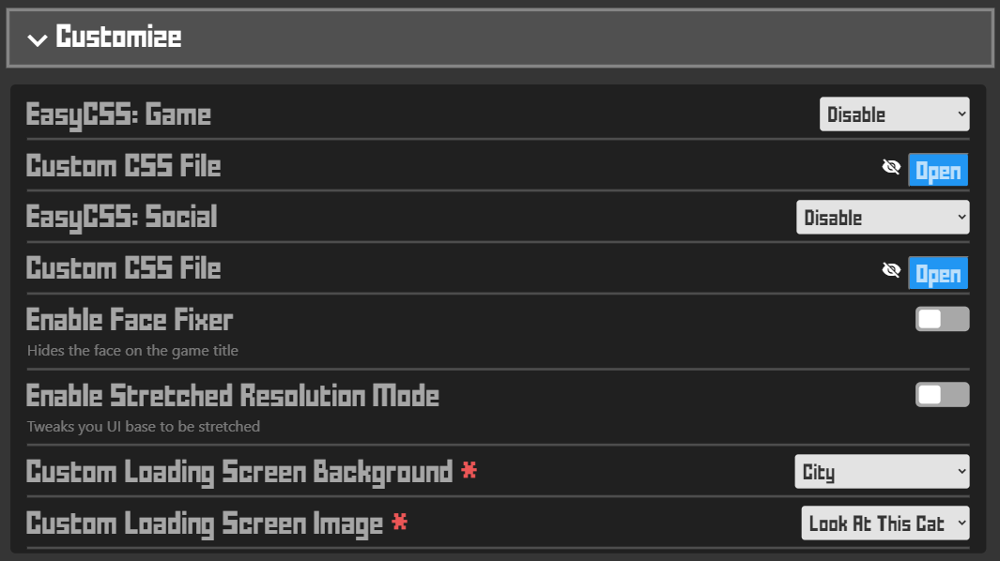
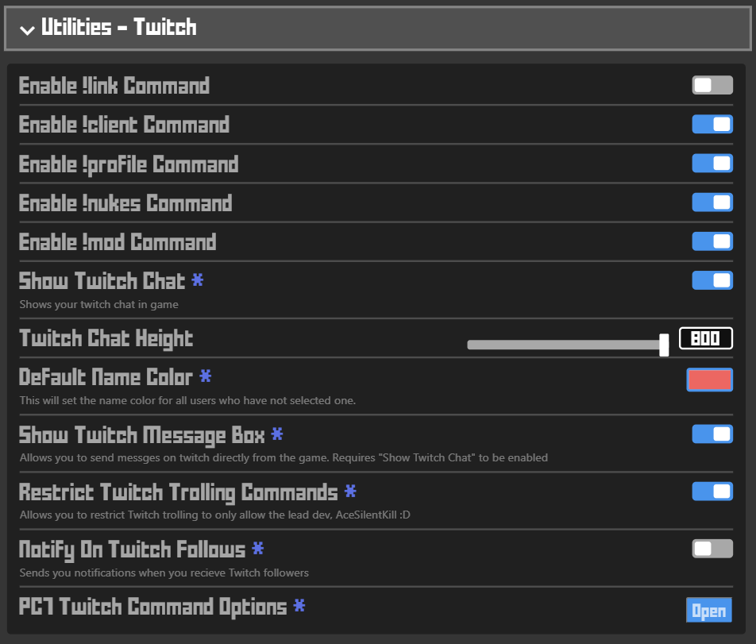
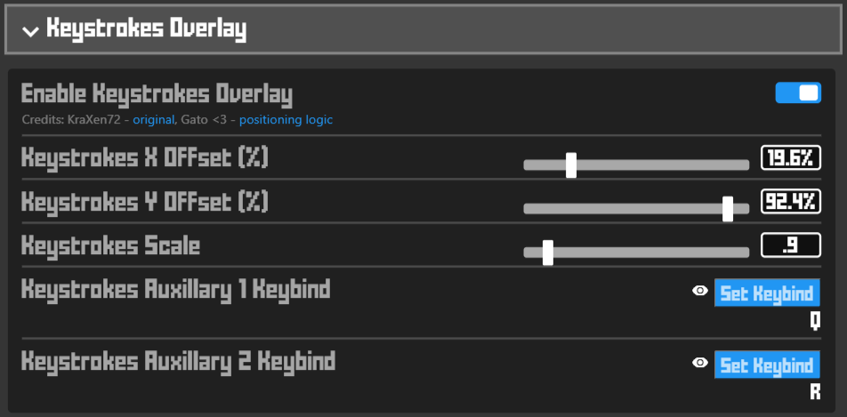
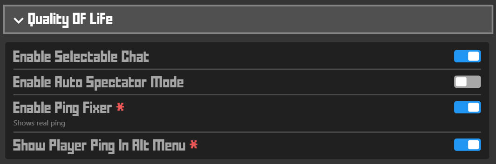
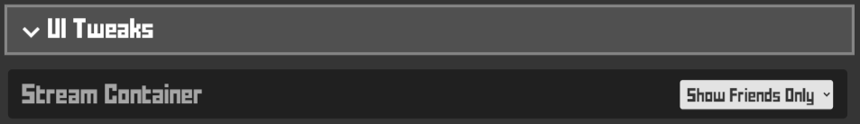
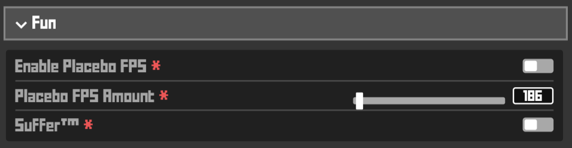

<!--
  Title: PC7 Client
  Description: A krunker client, PokeCuber7 client, krunker.io.
  Author: AceSilentKill
-->
# PC7 Client for Krunker 

 

  

## What is PC7?
**PC7 is short for PokeCuber7**  
- Originally built upon the ashes of LaF, PC7 brings a number of new features to the table  
- PC7 offers improved performance compared to other clients and browsers on most devices  
- PC7 has a very rich selection of features and the most advanced Twitch Integration found in any Krunker client  

## How do I install PC7?
1. Download the [client here](https://pc7client.com) by clicking *Download*. (Or view the latest releases [here](https://github.com/AceSilentKill/PC7-Client/releases/latest).)   

2. Run the file you downloaded.\
**Tip:** If your pc shows a message stating 'Windows protected your pc', ignore it. Just press 'Run anyway' to continue the installation.

3. Follow the dialog.\
**Tip:** Changing the defualt install path is not recommended.  

## Important Features
### Resource Swapper
- Path: `%HOMEPATH%\Documents\PC7Swap`  
- Works similar to other client's swappers. The folder structure works the same as your standard mod  
- Inside your `PC7Swap` folder there is also a JSON file named `externalResourceSwapper(.json)`  
  - This file can be used to redirect outbound requests for krunker's resources to resources not stored on your local machine  

### EasyCSS
\
EasyCSS is a system that allows you to load custom css files easier  
- This feature allows you to swap your CSS in real time, without resouce swapping or refreshing  
- Many of our CSS files are frequently updated, including some formerly-popular CSS files that broke after Krunker's most recent UI changes
 
### Twitch Integration

1. Login to Twitch in settings  
2. Restart PC7  

- Your viewers can use `!link` command in your stream chat when the setting is enabled to get the link to your game 
- Your twitch chat (emotes + role badges) can be shown in game above game chat  
- You can customize the default name color for users with no color set, as well as the height of the twitch chat element 

### Tips
- You can toggle whether `!link` command is enabled in your stream chat in settings or via the link button when alt manager UI is enabled.
- You can right click the link button when alt manager UI is enabled to send the game link even when the command is disabled for your viewers.

## Keyboard Overlay
\
PC7 lets you configure your keyboard overlay.

## Quality Of Life Features
\
PC7 offers a variety of standard "QOL" features.

## UI Tweaks
\
PC7 offers some UI tweaking features. (More to come)

## Fun Options
\
PC7 offers a variety "fun" features.

## Chat Logs
\
PC7 allows you to save logs of game chat.
 - Enables easier screenshots or copying in situations where game chat may scroll too fast.
 - All items clickable inside game chat are clickable inside your chat logs as well.
 - Right click a log to copy all text.

## Keybinds
|  Key  |         Function         |
| :---: | :----------------------: |
|  F1   |     Open Chat Logger     |
|  F2   |        Log Chats         |
|  F3   |    Connection Checker    |
|  F4   |      HyperQuickJoin      |
|  F5   |          Reload          |
|  F6   |     Join a New Game      |
|  F7   |      Copy Game URL       |
|  F8   |  Open URL in Clipboard   |
|  F12  |      Open DevTools       | 

## <3
Special thanks to the following people who supported the development of this project:
 - [Error](https://krunker.io/social.html?p=profile&q=Error430): Significant client API work, pc7 discord bot 
 - [Creepycats / Gato](https://krunker.io/social.html?p=profile&q=creepycats): Advice, keystrokes overlay movement, and some initial help with client features
 - [Forgoted / тєямιηαℓ](https://krunker.io/social.html?p=profile&q=%D1%82%D1%94%D1%8F%D0%BC%CE%B9%CE%B7%CE%B1%E2%84%93): Client build actions, advice
 - [KraXen72](https://github.com/KraXen72/): Some launch arguments, pretty keystrokes overlay base
 - [Z3dboy](https://krunker.io/social.html?p=profile&q=ASA_z3db0y): Client build actions

## About The Developers
### [AceSilentKill](https://krunker.io/social.html?p=profile&q=acesilentkill) / **Client Dev, Designer**
### [Error](https://krunker.io/social.html?p=profile&q=Error430) / **Client Dev, Designer**
### [PokeCuber7](https://krunker.io/social.html?p=profile&q=PokeCuber7) / **Owner, Designer**

**This project was originally based off of the works of the original authors listed here: https://github.com/LaFClient/LaF#readme**  
**The original license from is bundled within the application files**
