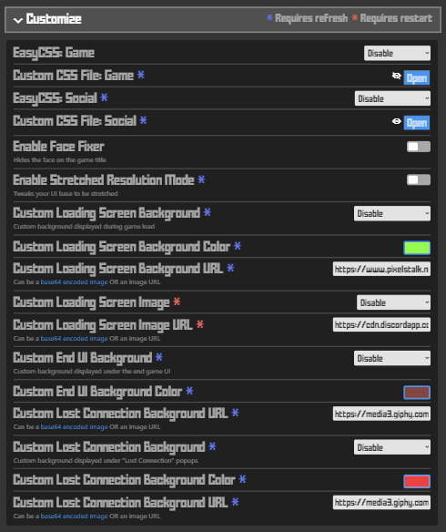
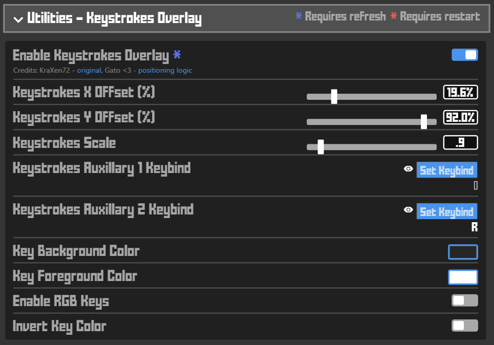
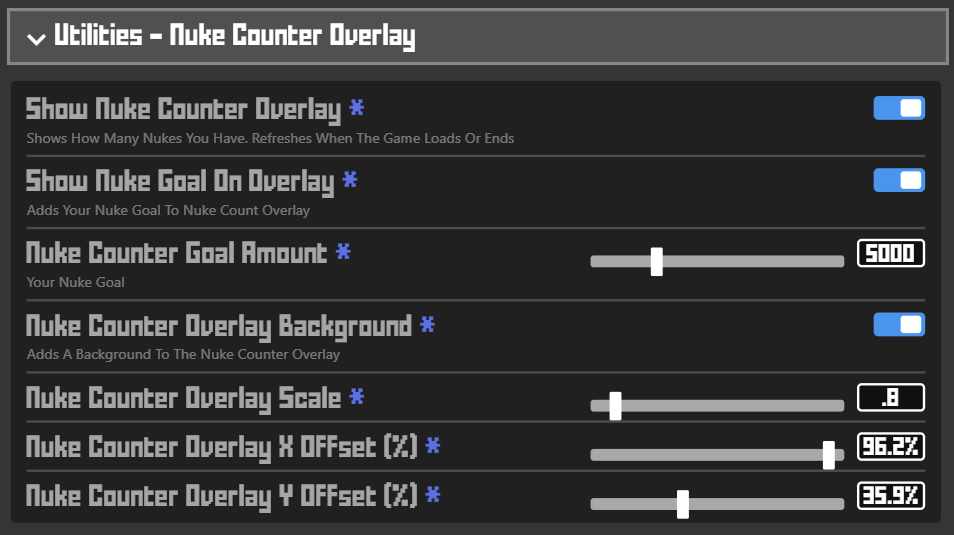
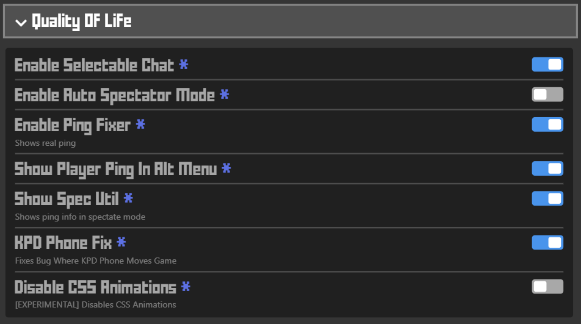
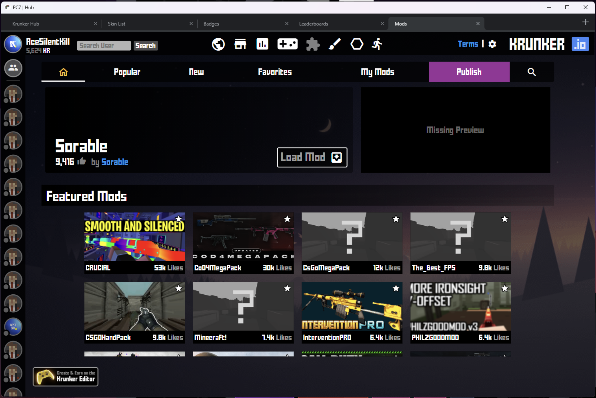

<!--
  Title: PC7 Client
  Description: A krunker client, PokeCuber7 client, krunker.io.
  Author: AceSilentKill
-->
# PC7 Client for Krunker 

 

  

- [PC7 Client for Krunker](#pc7-client-for-krunker)
  - [What is PC7?](#what-is-pc7)
  - [How do I install PC7?](#how-do-i-install-pc7)
- [Important Features](#important-features)
  - [Resource Swapper](#resource-swapper)
  - [EasyCSS & Customization](#easycss--customization)
  - [Twitch Integration](#twitch-integration)
  - [Keystrokes Overlay](#keystrokes-overlay)
  - [Nuke Counter Overlay](#nuke-counter-overlay)
  - [Quality Of Life Features](#quality-of-life-features)
  - [UI Tweaks](#ui-tweaks)
  - [Fun Options](#fun-options)
  - [Chat Logs](#chat-logs)
  - [Userscripts](#userscripts)
  - [Social Hub](#social-hub)
- [Default Keybinds](#default-keybinds)
- [<3](#3)
- [About The Developers](#about-the-developers)
- [Final Notes](#final-notes)

## What is PC7?
**PC7 is short for PokeCuber7**  
- Originally built upon the ashes of LaF, PC7 brings a number of new features to the table  
- PC7 offers improved performance compared to other clients and browsers on most devices  
- PC7 has a very rich selection of features and the most advanced Twitch Integration found in any Krunker client  

## How do I install PC7?
1. Download the [client here](https://pc7client.com) by clicking *Download*. (Or view the latest releases [here](https://github.com/AceSilentKill/PC7-Client/releases/latest).)   

2. Run the file you downloaded.\
**Tip:** If your pc shows a message stating 'Windows protected your pc', ignore it. Just press 'Run anyway' to continue the installation.

3. Follow the dialog.\
**Tip:** Changing the defualt install path is not recommended.  

## Important Features
### Resource Swapper
- Path: `%APPDATA%\PC7\PC7Swap`  
- Works similar to other client's swappers. The folder structure works the same as your standard mod  
- Inside your `PC7Swap` folder there is also a JSON file named `externalResourceSwapper(.json)`  
  - This file can be used to redirect outbound requests for krunker's resources to resources not stored on your local machine  

### EasyCSS & Customization
\
- EasyCSS is a system that allows you to load custom css files easier:
  - This feature allows you to swap your CSS in real time, without resouce swapping or refreshing  
  - Many of our CSS files are frequently updated, including some formerly-popular CSS files that broke after Krunker's most recent UI changes  
- The Customize options allow you customize a lot of UI with many different options   
 
### Twitch Integration

To use Twitch Integration you must connect PC7 to your Twitch account in settings  

Our Twitch Integration allows you to use a live, interactive chat within the game itself  
It has many features designed to make PC7 the best client for content creation  

PC7 has many commands that content creators would traditionally use Twitch bots for: 
- `!link`: Sends a chat with a link to your current game  
- `!client`: Sends a chat with a link to the client  
- `!profile`: Sends a chat with a link to your profile  
- `!nukes`: Sends a chat with your total amount of nukes  
- `!mod`: Sends a chat with info about your currently loaded mod  
These commands require much less effort to maintain when compared to traditional, manually-updated Twtich bot responses  

Our Twitch Integration also brings a unique experience will the ability to allow your viewers to run special commands:
- Different commands can be set to be available to different types of viewers (EX: Mod, Vip, Sub), and range from playing sounds to fun visual filters
- You can link many of these commands to your Twitch channel rewards as well  

### Keystrokes Overlay
\
PC7 lets you configure an easy-to-use keystokes overlay  
- The keys used are determined based off of your krunker keybinds  

### Nuke Counter Overlay
\
PC7 lets you configure an easy-to-use nuke counter overlay  
- This overlay will update your nuke count between games  

### Quality Of Life Features
\
PC7 offers a variety of standard "QOL" features  

### UI Tweaks
\
PC7 offers some UI tweaking features (more to come)  

### Fun Options
\
PC7 offers a variety of "fun" features (aka useless) 

### Chat Logs
\
PC7 allows you to save logs of both game chat and trade chats  
 - This allows for much easier screenshots or copying in situations where chat may scroll too fast  
 - All clickable links inside the game chat are clickable inside your chat logs as well (while the game window is open)  
 - You can filter messages by type to make screenshotting much more convenient

### Userscripts
PC7 allows you to use your own userscripts
For more information, please read [our documentation](./docs/userscripts.md)

### Social Hub
\
PC7 has an advanced tab system baked into social hub to make using social hub much easier
- The tabs function the same as your standard chrome tabs
- Tabs are auto muted when they are not focused
- The default chrome shortcuts for opening/closing tabs are supported

## Default Keybinds
|  Key  |         Function         |
| :---: | :----------------------: |
|  F1   |      Open Chat Logs      |
|  F2   |   Suspect Command (KPD)  |
|  F3   | Connection Check Command |
|  F4   |      HyperQuickJoin      |
|  F5   |          Reload          |
|  F6   |     Join a New Game      |
|  F7   |      Copy Game URL       |
|  F8   |  Open URL in Clipboard   |
|  F11  |        Fullscreen        | 
|  F12  |      Open DevTools       | 
|  Shift + F1 |    Open Alt Manager   | 
|  CommandOrControl + Shift + F1  |      Restart Client      | 
|  CommandOrControl + Shift + F9  |  Temporarily Remove CSS  | 
|  CommandOrControl + Shift + F10  |  Disable Autoload Mods  |

You may change these keybinds at any time by opening the keybinds settings menu (found under `Settings > Client > General > Client Bind Options`)

## <3
Special thanks to the following people who supported the development of this project:
 - [Error](https://krunker.io/social.html?p=profile&q=Error430): Significant client API work, some client features 
 - [Creepycats / Gato](https://krunker.io/social.html?p=profile&q=creepycats): Advice, keystrokes overlay movement, and some initial help with client features
 - [Forgoted / тєямιηαℓ](https://krunker.io/social.html?p=profile&q=%D1%82%D1%94%D1%8F%D0%BC%CE%B9%CE%B7%CE%B1%E2%84%93): Client build actions, advice
 - [KraXen72](https://github.com/KraXen72/): Some launch arguments, pretty keystrokes overlay base
 - [Z3dboy](https://krunker.io/social.html?p=profile&q=ASA_z3db0y): Client build actions
 - [Vaq1](https://krunker.io/social.html?p=profile&q=7evel): Significant badge work, client design

## About The Developers
### [AceSilentKill](https://krunker.io/social.html?p=profile&q=acesilentkill) / **Client Dev, Designer**
### [PokeCuber7](https://krunker.io/social.html?p=profile&q=PokeCuber7) / **Owner, Designer**

## Final Notes
Please join [our discord](https://discord.gg/BxweEFyZFm) to stay in the loop on updates, partnerships, and opportunities to earn some badges :)

**This project was originally based off of the works of the original authors listed here: https://github.com/LaFClient/LaF#readme**  
**The original license from is bundled within the application files**  
**While near zero code remains from the original base of this project, credit must be given where it is due <3**
